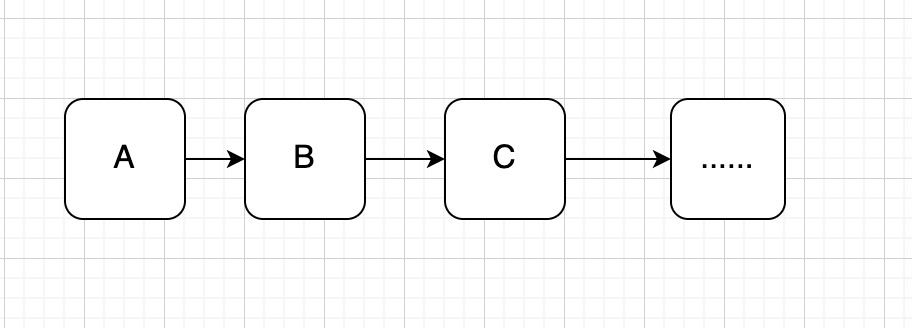
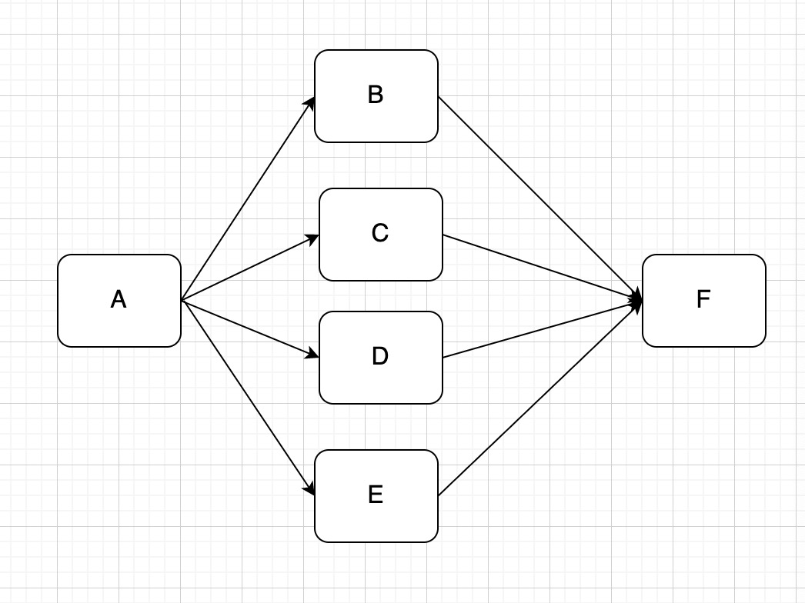
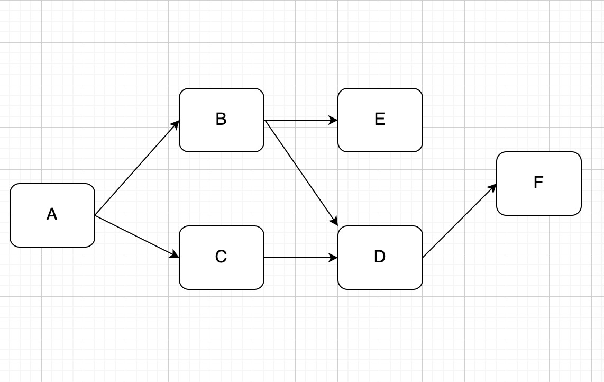
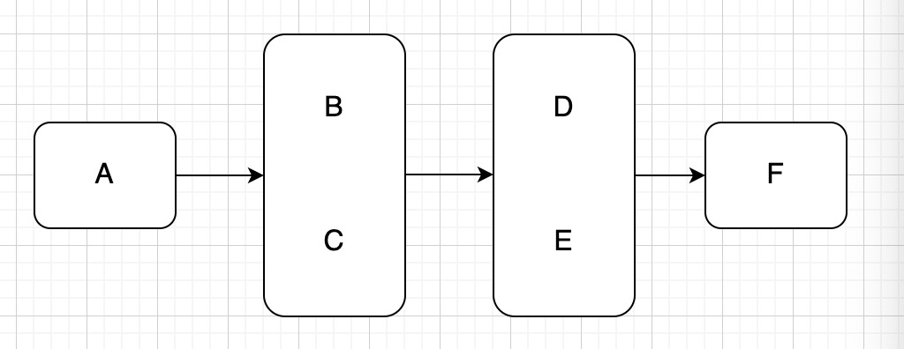

# WorkFlow
## 概述
有时候完成一个任务可能需要执行A、B、C、D、E、F...若干子个任务。可能是这样子的，A完成后执行B，B完成后执行C...直到所有任务完成：

也可能是这样子的：先执行A，A完成后可以并发执行BCDE，BCED都完成后执行F，F完成则流程完成：

还可能是这样子的：先执行A，A执行完以后同时执行BC，B完成后执行E，D则要等BC完成之后才能执行，D完成后执行F，EF执行完成则流程完成：

如果按照任务顺序直接写则需要很多的Callback层层嵌套来确保任务顺序，把自己都绕晕，过一段时间以后再看，可能就不知道自己身在何处，所为何事。如果有一个工具，可以按照需求构建任务流程，并且在统一等地方回调各个任务的进度及结果，则可以将子任务解耦，降低代码的复杂度和耦合度。WorkFlow就是为了这个目的而来。
## WorkFlow
WorkFlow简化了复杂任务的构建流程，统一监听子任务的回调。可以设置某个子任务是必须/非必须的，这样在任务失败时就会终止工作流，或者忽视失败，继续流程。可以让子任务报告进度，也可以在某些时候主动终止流程。只需要按照下面步骤，即可完成实现工作流：
1. 创建子任务Task；
2. 将Task添加到工作流，并定义它们的前后依赖关系；
3. 开始执行工作流，并监听工作流的进度回调。

### 图式流程：
各个子任务的前后依赖关系直接明确，但看起来可能会比较复杂，如图：

如下所示代码构建该流程：
```kotlin
    val procedure = Procedure()
    val taskA = Task("taskA") { it.complete() }
    val taskB = Task("taskB") { it.complete() }
    val taskC = Task("taskC") { it.complete() }
    val taskD = Task("taskD") { it.complete() }
    val taskE = Task("taskE") { it.complete() }
    val taskF = Task("taskF") { it.complete() }
    procedure.apply {
        addTask(null, taskA)
        addTask(arrayOf(taskA), taskB)
        addTask(arrayOf(taskA), taskC)
        addTask(arrayOf(taskB, taskC), taskD)
        addTask(arrayOf(taskB), taskE)
        addTask(arrayOf(taskD), taskF)
    }.start(object : OnProcedureListener {

        override fun onCompleted() {
        }

        override fun onFailed(task: Task) {
        }

    })
```

### 队列式流程：
只知道任务但先后关系，但是具体的依赖关系不明确，如图：

如下所示代码构建该流程：
```kotlin
    val taskA = Task("taskA") { it.complete() }
    val taskB = Task("taskB") { it.complete() }
    val taskC = Task("taskC") { it.complete() }
    val taskD = Task("taskD") { it.complete() }
    val taskE = Task("taskE") { it.complete() }
    val taskF = Task("taskF") { it.complete() }
    val workFlow = WorkFlow()
    workFlow.addProcedure(Procedure().addTask(taskA))
    workFlow.addProcedure(Procedure().addTask(taskB).addTask(taskC))
    workFlow.addProcedure(Procedure().addTask(taskD).addTask(taskE))
    workFlow.addProcedure(Procedure().addTask(taskF))
    workFlow.start(object : OnProcedureListener {

        override fun onCompleted() {
        }

        override fun onFailed(task: Task) {
        }

    })
```
## 项目地址
就是如此简单，既可以构建复杂的工作流，如何实现的，见github上的项目：[WorkFlow](https://github.com/Hbottle/WorkFlow)